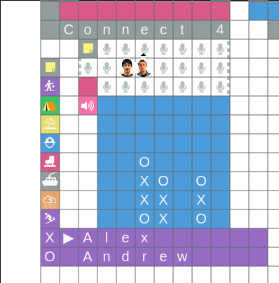

# Virtual RC Connect Four

This is a bot for playing games of connect four in [the Virtual RC space](https://www.recurse.com/virtual-rc). It logs in as a user using a cookie and CSRF token provided in the `config.json` file, and uses that to listen for the positions of players, and to edit the text on walls to display the board.

Feel free to copy this code to make other games and tools, or to make pull requests with improvements!

</img>
